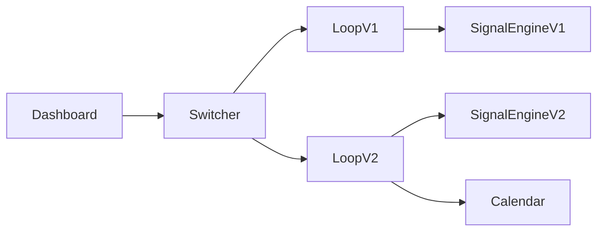
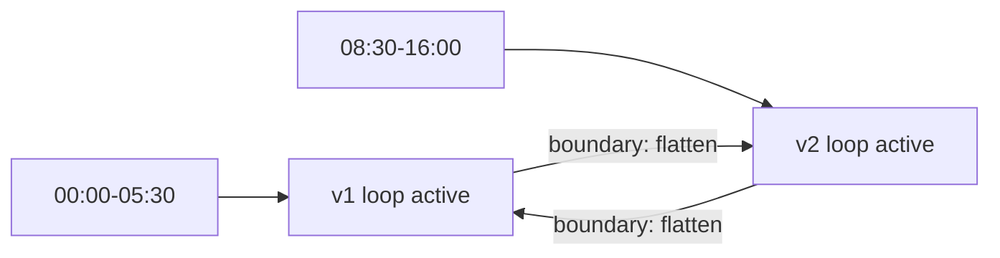

## Disclaimer

This software is provided “as is” with no warranties. Trading involves substantial risk and you can lose money. You are solely responsible for any losses or damages resulting from use of this tool. Use at your own risk.

## Usage Warning

This project is configured the way I have found works best in my testing, but it may not fit your account, broker, or market conditions. Always start on a **practice/sim account**, validate behavior, and only then consider a combine or live account. Do not assume past results will continue.

This tool works best with a stable, low‑latency internet connection. A wired connection is preferred.

# TopstepX MF v4 (Switch)

This medium-frequency version runs two strategies and switches between them by GMT time. It keeps v1 and v2 logic isolated in separate files and enforces trade windows, cooldowns, and (for v2) a manual news calendar filter.

## Overview

- **v1 strategy window:** default `00:00–05:30` GMT (UTC)
- **v2 strategy window:** default `08:30–16:00` GMT (UTC)
- **Switching:** at the window boundary the system **flattens open positions**, then switches loops
- **Cooldowns:** always on, with separate values for v1 and v2
- **Calendar filter:** v2 respects the manual news calendar during its window

## Quick Start

1. Install dependencies:
   - `python -m pip install -r requirements.txt`
2. Run the app:
   - `python "topstepx_hf_v4/main.py"`
3. In the **Connection** tab:
   - Enter Username + API Key
   - Click **Login**
   - Click **Load Accounts**
   - Click **Load Contracts**
4. The contract is **auto-selected** to Micro Gold (symbol/name contains `MGC`).
5. Use **Start Signals** to begin, **Start Live Feed** for quotes.

## What v4 Is Doing

v4 runs two independent loops and routes signals based on time:

- **v1 loop** uses the v1.5 behavior (retrace-based trigger).
- **v2 loop** uses the v2 behavior (edge trigger, calendar filter).
- Both loops share the same UI, account, and order settings.
- Only one loop is active at a time.

### Architecture Flow

### Time Window Switch

## Key Settings

### Account & Order Size

- **Account dropdown** controls which account is used for new orders.
- **Order size** applies immediately for new orders.
- Existing trades are not resized mid-trade.

### Trade Windows (Always On)

Two separate windows are used:

- **V1 window** (`00:00–05:30` by default)
- **V2 window** (`08:30–16:00` by default)

These windows are enforced **inside each loop**. If a window is closed, the loop will ignore signals.

### Stoploss Cooldowns (Always On)

Two independent cooldowns:

- **Cooldown v1 (sec)**: applies to v1 trades
- **Cooldown v2 (sec)**: applies to v2 trades

These are always enforced and do not require restart.

### Calendar Filter (v2 only)

The calendar is only used by v2:

1. Add events in the **Calendar** tab.
2. Enable the calendar filter.
3. During the pre/post window, v2 will block signals.

Calendar data is stored in `topstepx_hf_v4/calendar.json`.

## Backtesting Behavior

The backtest in v4 **switches logic by time window**, matching live behavior:

- v1 logic outside v2 window
- v2 logic inside v2 window
- Open trades are flattened on window boundary (exit reason `SWITCH`)

## Troubleshooting

### Live feed struggling at market open

Common causes:

- Hub not ready when reconnect happens
- Contract not live or rolled over at reopen
- Token expired
- Network/websocket issues

If you see repeated reconnect logs, verify contract availability and try reloading contracts.

### Wrong contract selected

Contract auto-pick searches for `MGC` in symbol or name. If your broker uses a different naming pattern, update the filter logic in:

- `topstepx_hf_v4/main.py` → `_set_contracts()`

## File Map

- `main.py`: UI and settings
- `topstepx/strategy_switcher.py`: window switching + flatten
- `topstepx/trading_loop_v1.py`: v1 loop
- `topstepx/trading_loop_v2.py`: v2 loop
- `topstepx/signal_engine_v2.py`: v2 signals
- `topstepx/news_calendar.py`: manual calendar filter

